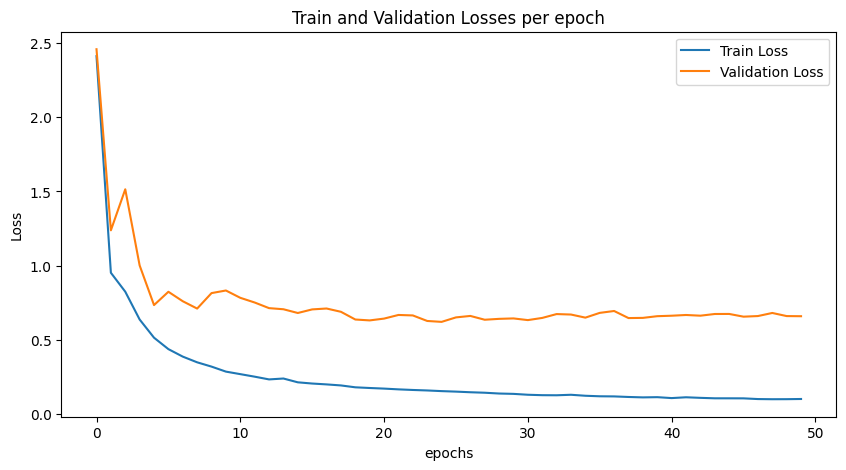
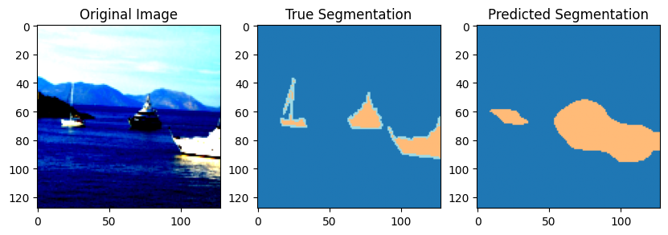
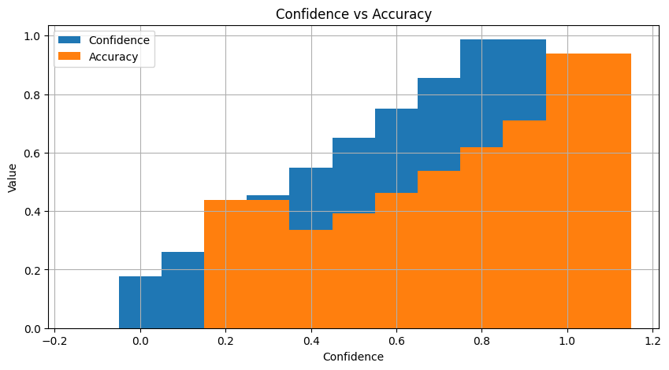

## CS229 HW2 Report

### (a) Hyper-parameter choices (1 point)

- Learning rate: 0.01
- Optimizer: SGD with momentum 0.9 and weight decay 0.
- Number of training epochs: 50
- Batch size: 64
- Image resizing/cropping to 128x128 pixels , normalization of input images, and conversion of label images to integer tensors

### (b) Plot train and validation loss curves (1 point)

### (c) Accuracy metric (1 point)

Overall accuracy: 0.8254367512030408

### (d) Visualize an image from the validation set, its true segmentation, and the predicted segmentation (3 points)

### (e) Plot confidence calibration curve on test data (2 points)

### (f) Expected calibration error (1 point)

ECE: 0.08577567760547286

### (g) AI collaboration statement (1 point to include)

In this project, I used OpenAI's ChatGPT to help me answer questions, provide guidance, and generate code snippets. ChatGPT's assistance facilitated a better understanding of the project requirements and helped troubleshoot issues that arose during implementation.

In fact, the entire report above was basically done by me using chatgpt, and he generated it for me automatically after I provided him with the code and write-up requirements, except for the images and the requested results which I had to add manually. I think this is very shocking, and in some ways it will greatly improve our productivity.
